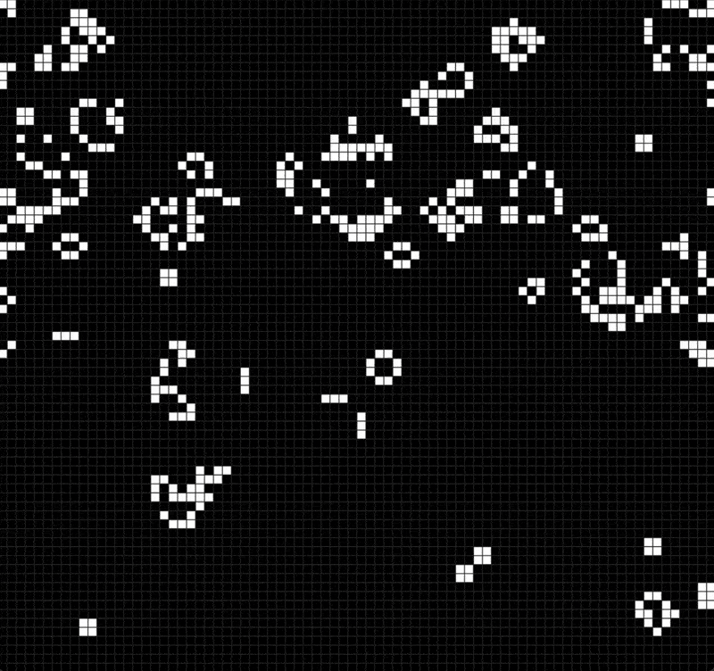

# Conway's Game of Life

## Preview


## Description
Implementation of John Conway's classic cellular automaton "Game of Life".

## Rules
- A live cell with 2-3 neighbors survives
- A live cell with <2 or >3 neighbors dies
- A dead cell with exactly 3 neighbors becomes alive

## Installation
1. Clone the repository:
```bash
   git clone https://github.com/UlanKurmanbekov/game-of-life.git
   cd game-of-life
```

2. Install dependencies:
```bash
   pip install -r requirements.txt
```

## Usage
```bash
python main.py
```

## Controls
**Keyboard:**
- `SPACE` - Pause/Unpause simulation
- `C` - Clear grid

**Mouse:**
- `Left Click` - Draw cells (when paused)
- `Right Click` - Erase cells (when paused)

## Technologies
- Python
- Pygame for visualization
- NumPy for efficient computations